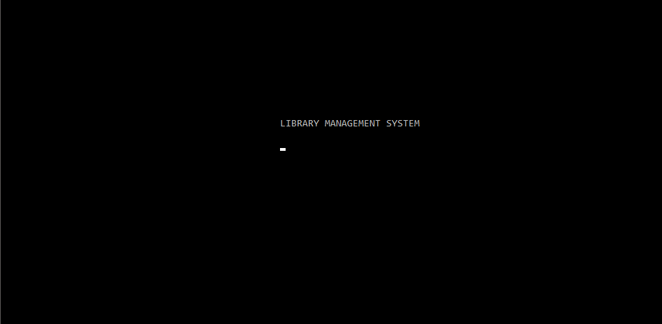
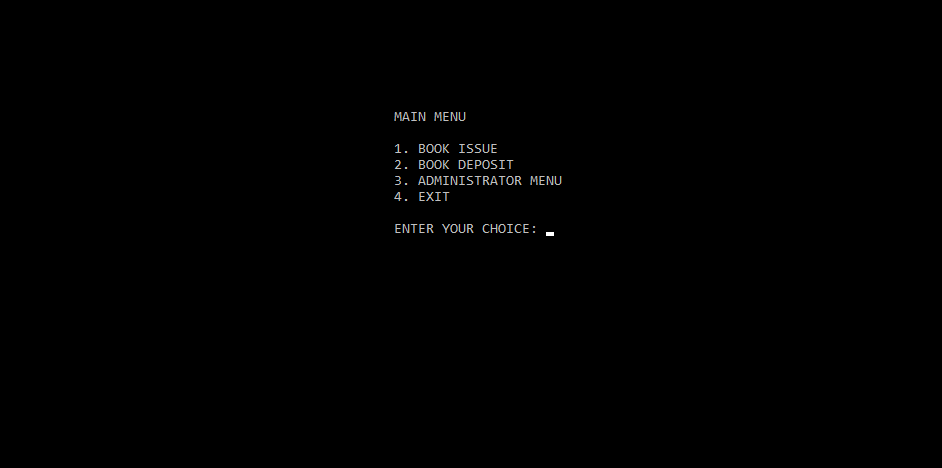
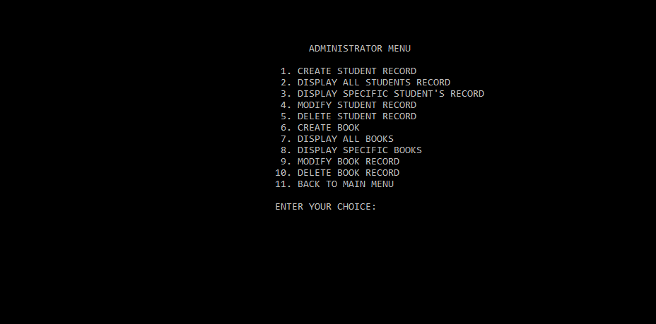

# Library-Management-System-in-C++

## Motivation:
----------------------------
This is a simple library management project developed to work on command line interface.

## Features:
---------------------------
* Add, delete, modify and view students' data.
* Add, delete, modify and view books' data.
* Issue books.
* Deposit books.

## Concepts used:
---------------------------
* Functions
* Classes & Objects
* File handling

## Compiler Used:
--------------------------
GNU GCC

## Screenshots
----------------------------
**Home Screen**

**Main Menu**

**Administrator Menu**

